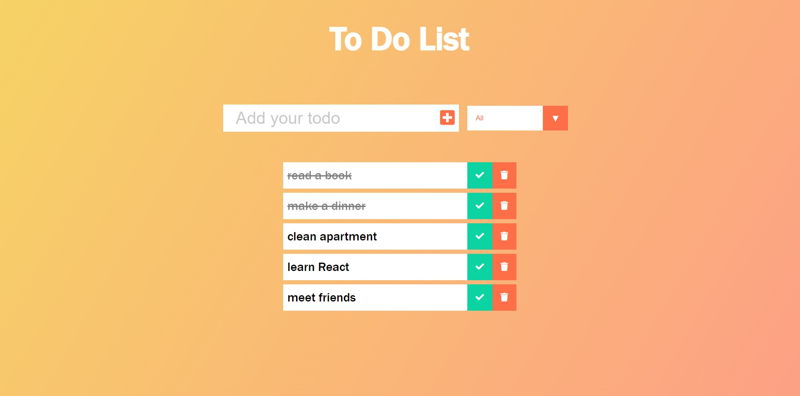

# TODO App

## A Todo List Web Application made with React.

A todo list web application is a digital tool designed to help individuals and teams manage their daily tasks and activities. This application allows users to create and organize their to-do lists, set deadlines and reminders, assign tasks to team members, and track progress in real-time.

## Features

-   Adding, Editing, Deleting and marking Completed tasks
-   Filter tasks by All, Active, Completed
